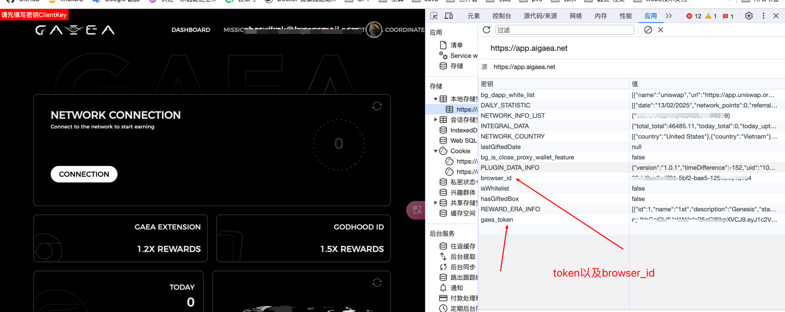

# GAEA交互脚本 v1.0
## 注意事项 ⚠️
**重要安全提示：**
- 使用高匿名代理服务防止账号关联
- 账号Token需定期更新维护
- 禁止用于任何违法用途

## 社区支持
- 💬 官方：[空投信息、脚本TG频道](https://t.me/ilsh_auto)
- 🐦 最新公告：[我们的推特](https://x.com/hashlmBrian)

## 功能特点
- 🕒 24小时自动化保活系统
- 🌐 智能代理轮换机制
- 📊 实时网络积分监控
- ✅ 自动每日签到系统
- 📈 多账号批量管理
- 🔐 UID自动获取验证

## 安装说明

### 环境要求
- Python 3.8+
- 稳定代理服务
- Linux/Windows/macOS

---

### 快速开始

#### 节点运行
browser_id、token获取：


克隆仓库
```
git clone https://github.com/ilshAuto/gaea_auto.git
```
````
cd gaea_auto
````
安装依赖
````
pip install -r requirements.txt
````
准备账号文件 (account)
````
格式：email----password----browser_id----proxy----token
示例：
user1@domain.com----password123----chrome_12345----socks5://127.0.0.1:1080----eyJhbGci...
````
启动程序
````
python gaea_run.py
````


tip：需提前获取token、browser_id，我会提供一种我的登录方式在我的TG频道：（https://t.me/ilsh_auto）

---

## 配置文件说明
account 文件格式：
email----password----browser_id----proxy----token
参数说明：
email: 注册邮箱
password: 账户密码
browser_id: 浏览器指纹ID
proxy: SOCKS5代理地址
token: API授权令牌


## 免责声明
本脚本仅用于区块链技术研究，使用者应遵守当地法律法规。连续运行可能会对账号产生不可预知的影响，开发者不承担任何因使用本脚本导致的账号异常、资产损失等责任。